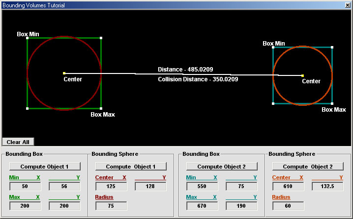



## Bounding Volumes Tutorial/Demo

### Description

I got thinking... What good is collision detection tutorials/demos if theres no tutorials/demos on bounding volumes? Thats the heart of 90% of the collision detection algorithms. This will show how to compute bounding box's and bounding spheres for an object. It also shows how to compute the distance from the center-center of the object and the edge-edge distance (Collision Distance). I made it in hopes this will help someone understand collision detection better. If it helps you or you like it please vote and please, please leave some feedback. Thanks everyone.

-James-
 
### More Info
 

             |
---                |---
**Submitted On**   |2002-09-07 11:46:06
**By**             |[James Dougherty](https://github.com/Planet-Source-Code/PSCIndex/blob/master/ByAuthor/james-dougherty.md)
**Level**          |Intermediate
**User Rating**    |5.0 (25 globes from 5 users)
**Compatibility**  |VB 6\.0
**Category**       |[Games](https://github.com/Planet-Source-Code/PSCIndex/blob/master/ByCategory/games__1-38.md)
**World**          |[Visual Basic](https://github.com/Planet-Source-Code/PSCIndex/blob/master/ByWorld/visual-basic.md)
**Archive File**   |[Bounding\_V128085972002\.zip](https://github.com/Planet-Source-Code/james-dougherty-bounding-volumes-tutorial-demo__1-38752/archive/master.zip)

